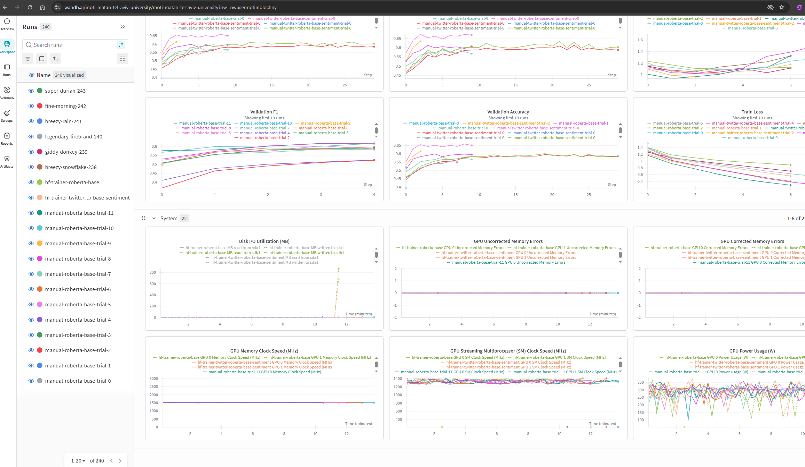

# adv_dl_project

Team M’s advanced deep learning project.

##  Project Structure

- `requirements.txt` – Python packages required for this project
- `part1.ipynb` – Data preparation, exploration, and initial model setup
- `part2.ipynb` – Advanced modeling, experiments, and analysis

##  Setup & Execution Guide

### 1. Clone the repository
```bash
git clone https://github.com/motimol/adv_dl_project.git
cd adv_dl_project
````

### 2. Create and activate a virtual environment (optional but recommended)
```bash
python -m venv venv
# On macOS/Linux:
source venv/bin/activate
# On Windows:
venv\Scripts\activate
```

### 3. Install project dependencies
```bash
pip install --upgrade pip
pip install -r requirements.txt
```

### 4. Open and run `part1.ipynb`
* Launch Jupyter Notebook or Jupyter Lab:
  ```bash
  jupyter notebook
  ```
* Navigate to `part1.ipynb`
* Execute all cells in order to preprocess data and perform initial analysis

### 5. Proceed to `part2.ipynb`
* Continue with advanced modeling, experimentation, or visualizations
* Make sure any outputs or intermediate data from Part 1 are properly referenced or passed into Part 2

## Environment Notes
* Recommended Python version: **3.8+**
* Use a virtual environment to avoid dependency conflicts
* Jupyter Lab is recommended for interactive development

## Extra:

